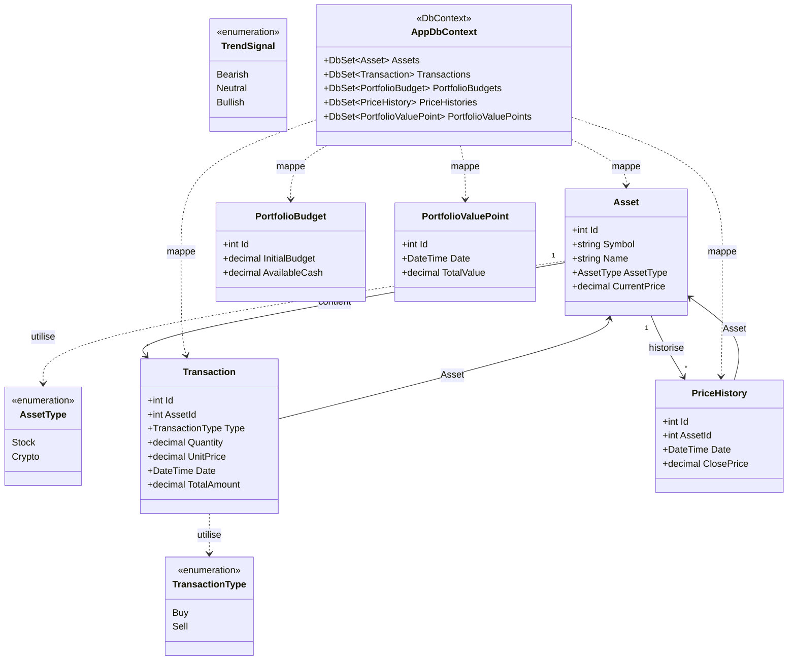
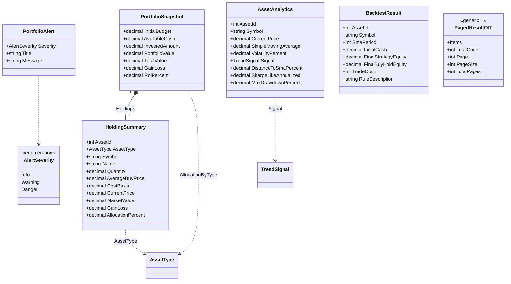
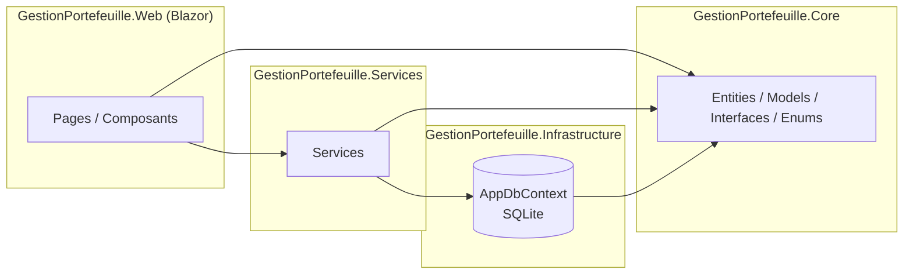

# Diagramme de classes — Gestion Portefeuille

Ce document décrit les classes principales du projet (couches **Core**, **Infrastructure**, **Services**).  
**Affichage** : prévisualisation Markdown dans Cursor / VS Code, ou copier-coller sur [https://mermaid.live](https://mermaid.live) pour exporter en **PNG** / **SVG** / **PDF**.

---

## 1. Domaine (entités EF Core + énumérations)

Modèle persistant et relations configurées dans `AppDbContext`.

---

## 2. Modèles de vue / DTO (couche Core.Models)

Données calculées ou transportées entre services et UI (non toutes persistées).

---

## 3. Services, interfaces et dépendances (architecture)

Les pages Blazor consomment les **interfaces** ; les implémentations utilisent `AppDbContext` (et parfois d’autres services).

```mermaid
classDiagram
    direction TB

    class AppDbContext {
        <<DbContext>>
    }

    class IAssetService {
        <<interface>>
        +GetAllAsync()
        +GetPagedAsync()
        +GetByIdAsync()
        +CreateAsync()
        +UpdateAsync()
        +DeleteAsync()
    }

    class ITransactionService {
        <<interface>>
        +GetAllAsync()
        +GetPagedAsync()
        +CreateAsync()
        +DeleteAsync()
    }

    class IPortfolioService {
        <<interface>>
        +GetSnapshotAsync()
        +GetBudgetAsync()
        +UpdateBudgetAsync()
        +RecordDailyPortfolioValueAsync()
        +GetPortfolioValueHistoryAsync()
    }

    class IAnalyticsService {
        <<interface>>
        +GetAssetAnalyticsAsync()
        +EnsurePriceHistorySeedAsync()
        +RunSmaTrendBacktestAsync()
    }

    class IPortfolioAlertService {
        <<interface>>
        +GetAlertsAsync()
    }

    class IPriceDataService {
        <<interface>>
        +RefreshMarketPricesAsync()
        +ImportPricesFromCsvAsync()
    }

    class AssetService {
    }

    class TransactionService {
    }

    class PortfolioService {
    }

    class AnalyticsService {
    }

    class PortfolioAlertService {
    }

    class PriceDataService {
    }

    class PositionCostHelper {
        <<static>>
        +FromTransactions()
    }

    class DbInitializer {
        <<static>>
        +SeedAsync()
    }

    AssetService ..|> IAssetService
    TransactionService ..|> ITransactionService
    PortfolioService ..|> IPortfolioService
    AnalyticsService ..|> IAnalyticsService
    PortfolioAlertService ..|> IPortfolioAlertService
    PriceDataService ..|> IPriceDataService

    AssetService --> AppDbContext
    TransactionService --> AppDbContext
    TransactionService --> IPortfolioService
    PortfolioService --> AppDbContext
    AnalyticsService --> AppDbContext
    PriceDataService --> AppDbContext
    PortfolioAlertService --> IPortfolioService
    PortfolioAlertService --> IAnalyticsService

    PortfolioService ..> PositionCostHelper : utilise
```

> **Note** : `PriceDataService` utilise aussi `HttpClient`, `IMemoryCache` et `IOptions~PriceDataOptions~` (non représentés ici pour garder le diagramme lisible).  
> `PortfolioAlertService` utilise `IOptions~AlertOptions~`.

---

## 4. Vue synthétique des couches (paquetages)

---

## Export pour le rapport PDF

1. Ouvrir [mermaid.live](https://mermaid.live).  
2. Coller l’un des blocs `mermaid` (sans les balises \`\`\`).  
3. **Actions → PNG / SVG** pour insérer dans Word / LaTeX / PowerPoint.

Pour un diagramme **UML officiel** (fichier `.uml` / PlantUML), indique-le et on pourra générer la variante PlantUML équivalente.
